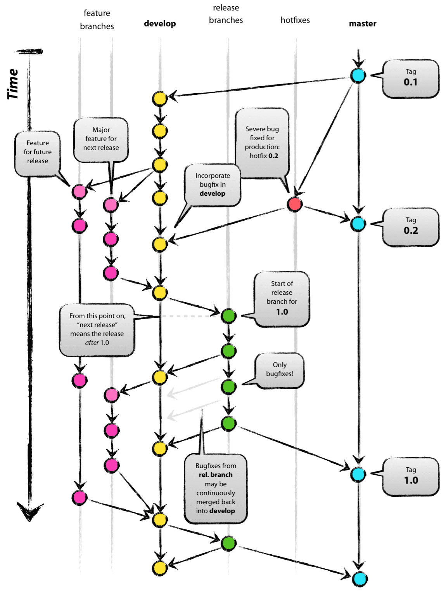

# Versioning

## Versioning Format 

Our versioning format is {platform version / marketing number}.{release}.{hotfix}

This is basically [Semantic Versioning](http://semver.org/) for an end user facing website
(rather than a developer tool / library).

## Branching Strategy

Vincent Driessen's recommended branching model:
http://nvie.com/posts/a-successful-git-branching-model/

When someone says Gitflow, they may or may not mean something pretty close to what Vincent advocates.
